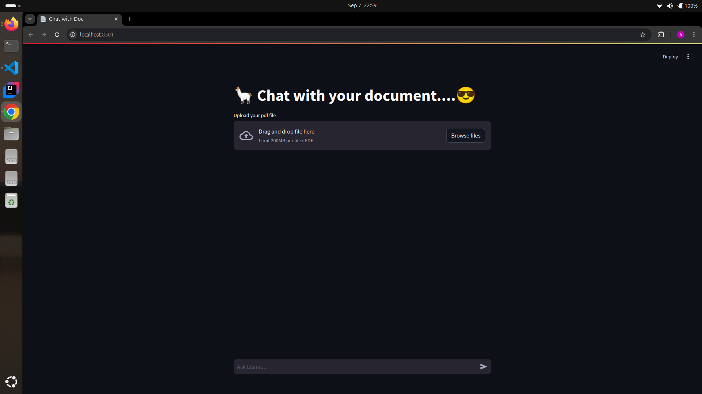
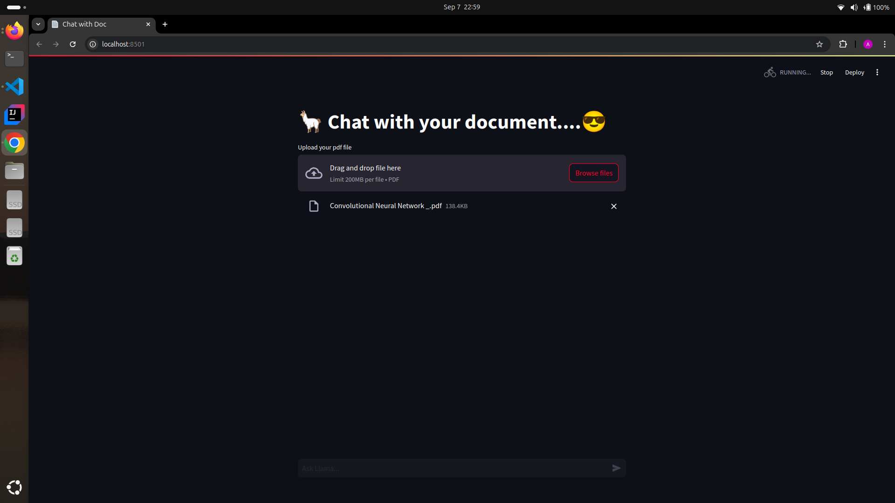
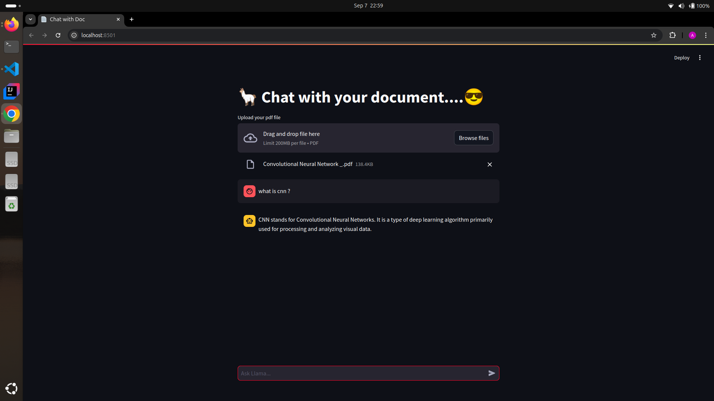
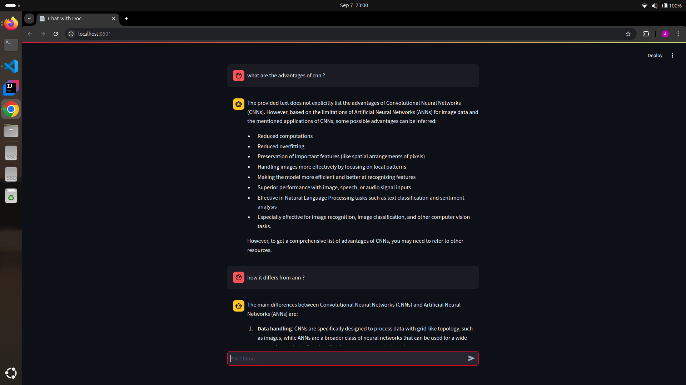

# 🦙 Chat with Document - Using LangChain and Llama

This project allows you to upload a PDF document and chat with it using a chatbot built with LangChain and the `llama-3.1-70b-versatile` model. The chatbot can answer queries based on the document's content and maintain conversational context.

## Features

- **PDF Upload**: Upload any PDF file, and the chatbot will extract information from it.
- **Conversational Context**: The chatbot remembers previous queries and provides context-aware answers.
- **Vector Embedding**: Uses HuggingFaceEmbeddings to convert document content into vectors and FAISS (Facebook AI Similarity Search) for efficient search.
- **Conversational Interface**: Built with Streamlit for an intuitive and interactive interface.
- **Llama Model**: Uses the `llama-3.1-70b-versatile` model for answering user queries based on the document content.

## Installation and Setup

### Prerequisites

- Python 3.12+
- Virtual environment (recommended)
- CUDA (optional for GPU support)

### Clone the Repository


```bash
git clone https://github.com/yourusername/chat-with-document.git
cd chat-with-document 

```


### Creating a Virtual Environment


```bash
# Install virtualenv if you don't have it
pip install virtualenv

# Create a virtual environment named 'env'
virtualenv env

# Activate the virtual environment
# On Windows:
.\env\Scripts\activate
# On macOS/Linux:
source env/bin/activate


```

### Install Dependencies


```bash
pip install -r requirements.txt

```


### Set Up Environment Variables
Create a .env file in the root directory of the project and add any necessary environment variables required for the project to run. An example might include:

makefile

```bash

API_KEY=your-api-key-here

```


### Running the Application


```bash

streamlit run src/main.py
```


### Project Structure

  -  src/: Contains the main application code.
  -  requirements.txt: Lists all the dependencies for the project.
  -  .env: Stores environment variables.


    
    
    
    

    